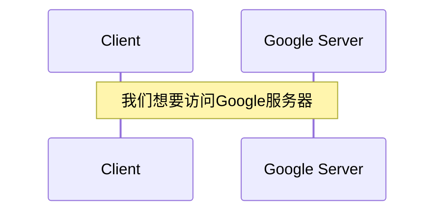
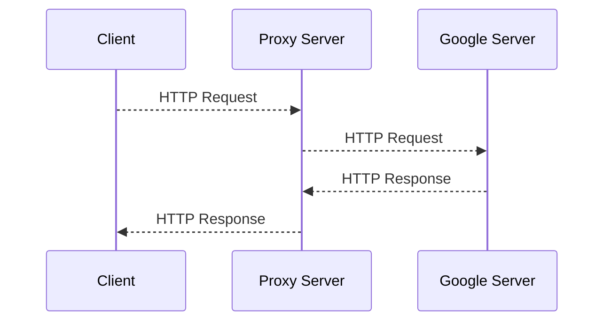
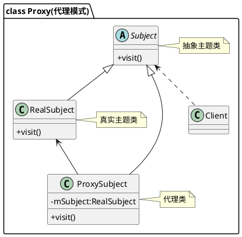

# Design Pattern 
## Proxy Pattern

---

# Introduction
-- What is Proxy?

<div class="grid grid-cols-2 gap-10 pt-4 -mb-6">

<div>

Example:



</div>

<div class="text-left">

**问题：**

- 我们没法直接访问Google服务器
- 但我们有一个在美国的朋友

**有什么解决办法？**


<div v-click> 

- 我们让美国的朋友访问Google服务器
- 美国的朋友再把结果告诉我们

**美国的朋友在这里就充当了代理的角色**

</div>
</div>
</div>

---

# Introduction
-- What is Proxy?



---

# Intention
-- Why we need proxy?

<br>

**设计意图**: 为其他对象提供一种代理以控制对这个对象的访问。

**主要解决**: 直接访问对象时会带来问题，例如:
- 要访问的对象在远程机器上
- 对象创建的开销很大
- 某些操作需要安全控制
- 需要进程外的访问

**何时使用**: 想在访问一个类时做一些控制。

**解决方案**: 增加中间层，即在访问此对象时加上一个对此对象的访问层

---

# Implementation
-- How to implement proxy?

<div class="grid grid-cols-2 gap-10 pt-4 -mb-6">
<div>
<b> 代理模式的主要角色如下：</b>

- Subject（抽象主体角色）
    - 通常是接口/抽象类，对业务逻辑进行定义
    - 定义 RealSubject 和 Proxy 的共用接口
- RealSubject（真实主体角色）
    - 业务逻辑的具体执行者
- Proxy（代理主体角色）
    - 负责对于真实主题的处理
- Client（客户）
    - 调用 Proxy 的客户端

</div>

<div>
<b>通用类图</b>


</div>
</div>

--- 

# Function and Classification
-- What does proxy do and how many types of proxy?
<div class="grid grid-cols-2 gap-8 mb-6">
<div class>
<b> 代理需要做什么？</b>

1. 保存一个引用使得代理可以访问实体。
    - Proxy会引用Subject，并提供相同的接口
    - 进而代理就可以用来替代实体。
2. 控制对实体的存取，并可能负责创建和删除它。
3. 根据不同的类型有不同的职责。


</div>
<div v-click>
<b> 代理有哪些类型？</b>

1. Remote Proxy（远程代理）
    - 为远程对象提供一个本地的代理对象
    - 例如：某国驻某国大使
2. Virtual Proxy（虚拟代理）
    - 根据需要创建开销很大的对象
    - 例如：抽奖券，只有在中奖时才会把实物搬来
3. Copy-on-Write Proxy （写时复制代理）
    - 只有修改时才创建新的对象
    - 例如：Snapshot快照技术
4. Smart Reference Proxy （智能引用代理）
    - 当一个对象被引用时，提供一些额外的操作
    - 例如：计算一个对象的引用次数

</div>
</div>

---

# Function and Classification
-- What does proxy do and how many types of proxy?
<div class="grid grid-cols-2 gap-4 mb-6">
<div>
<b> 代理有哪些类型？</b>

5. Protect or Access Proxy（保护代理）
    - 控制对一个对象的访问
    - 例如：权限控制
6. Cache Proxy（缓存代理）
    - 为开销大的运算结果提供暂时的存储空间
    - 例如：数据库查询缓存（Redis）
7. Firewall Proxy（防火墙代理）
    - 控制网络资源的访问，保护主体不被恶意攻击
    - 例如：防火墙
8. Synchronization Proxy（同步代理）
    - 在多线程环境下为主体提供安全的访问
    - 例如：线程安全

</div>
<div v-click>
<b> Java中的代理模式 </b>

根据代理类的生成时间不同可以将代理分为静态代理和动态代理两种。

1. **静态代理**
 
由程序员创建或工具生成代理类的源码，再编译代理类。所谓静态也就是在程序运行前就已经存在代理类的字节码文件，代理类和委托类的关系在运行前就确定了。

2. **动态代理**

动态代理类的源码是在程序运行期间由JVM根据反射等机制动态的生成，所以不存在代理类的字节码文件。代理类和委托类的关系是在程序运行时确定。 

</div>
</div>

--- 

# Example Code of Proxy
-- Protect or Access Proxy to ban access to some website

<div class="grid grid-cols-2 gap-4 mb-6">
<div>

```java {1-3|5-10|11-21|all}
public interface Internet {
    void connectTo(String serverhost) throws Exception;
}

public class RealInternet implements Internet {
    @Override
    public void connectTo(String serverhost) {
        System.out.println("Connecting to " + serverhost);
    }
}

public class Client {
    public static void main(String[] args) {
        Internet internet = new ProxyInternet();
        try {
            internet.connectTo("google.com");
            internet.connectTo("baidu.com");
        } catch (Exception e) {
            System.out.println(e.getMessage());
        }
    }
}

```

</div>

```java {0|all}
public class ProxyInternet implements Internet {

    private Internet internet = new RealInternet();
    private static List<String> bannedSites;

    static {
        bannedSites = new ArrayList<String>();
        bannedSites.add("google.com");
    }

    @Override
    public void connectTo(String serverhost) throws Exception {
        if (bannedSites.contains(serverhost.toLowerCase())) {
            throw new Exception("Access Denied" + serverhost);
        }
        internet.connectTo(serverhost);
    }
}
```
<div>
</div>
</div>

---

# Static Proxy and Dynamic Proxy
-- Advantages and Disadvantages

<div class="grid grid-cols-2 gap-4 mb-5">
<div>
<b> 静态代理 </b>

1. 优点
    - 在不修改目标对象的前提下，可以通过代理对象对目标对象功能扩展
    - 代理可以对客户端隐藏具体的实现类，达到解耦合的目的
2. 缺点
    - 代理类和委托类实现了相同的接口，代理类通过委托类实现了相同的方法。这样就出现了大量的代码重复。
    - 代理对象只服务于一种类型的对象，如果要服务多类型的对象。势必要为每种对象都进行代理。

</div>
<div v-click>
<b> 动态代理 </b>

我们想办法通过一个代理类来代理多个委托类，这样就可以减少代码量，提高效率。

<b> 1. JDK动态代理 </b>

- 代理对象，不需要实现接口，但是目标对象要实现接口，否则不能用动态代理
- 代理对象的生成，是通过 JDK 的 API（反射机制），动态的在内存中构建代理对象

<b> 2. CGLIB动态代理 </b>

- 目标对象只是一个单独的对象，并没有实现接口
- 通过在内存中构建一个子类对象从而实现目标对象功能扩展

</div>
</div>

---

# JDK Dynamic Proxy
-- Using InvocationHandler


```java
public class ProxyFactory {
    private Object target;

    public ProxyFactory(Object target) {
        this.target = target;
    }

    public Object getProxyInstance() {
        return Proxy.newProxyInstance(
                target.getClass().getClassLoader(),
                target.getClass().getInterfaces(),
                new InvocationHandler() {
                    @Override
                    public Object invoke(Object proxy, Method method, Object[] args) throws Throwable {
                        System.out.println("JDK Proxy start");
                        Object returnValue = method.invoke(target, args);
                        System.out.println("JDK Proxy end");
                        return returnValue;
                    }
                }
        );
    }
}
```
<p class="text">

被代理对象target通过参数传递进来，
<br>
通过target.getClass().getClassLoader()获取ClassLoader对象，
<br>
然后通过target.getClass().getInterfaces()获取它实现的所有接口，
<br>
再将target包装到实现了InvocationHandler接口的对象中。
<br>
通过newProxyInstance函数我们就获得了一个动态代理对象。

</p>

<style>
.text {
    position: absolute;
    top:20%;
    right:5%;
}
</style>

---

# CGLIB Dynamic Proxy
-- Using MethodInterceptor

```java
public class ProxyFactory implements MethodInterceptor {
    private Object target;

    public ProxyFactory(Object target) {
        this.target = target;
    }

    @override
    public Object intercept(Object obj, Method method, Object[] args, MethodProxy proxy) throws Throwable {
        System.out.println("CGLIB Proxy start");
        Object returnValue = method.invoke(target, args);
        System.out.println("CGLIB Proxy end");
        return returnValue;
    }

    public Object getProxyInstance(){
        Enhancer enhancer = new Enhancer();        // 为代理类指定需要代理的类，也即是父类
        enhancer.setSuperclass(target.getClass()); // 设置方法拦截器回调引用，对于代理类上所有方法的调用，都会调用CallBack
        enhancer.setCallback(this);                // 获取动态代理类对象并返回
        return enhancer.create();                  //创建子类对象，即代理对象
    }
}
```

---

# Aespect Oriented Programming (AOP)
-- Using Proxy Design Patten

```java
@Aspect
public class LogAspects{
    @Pointcut("execution(foo.*(..))")
    public void pointCut(){}            // 定义一个切点

    @Around("pointCut()")
    public Object around(ProceedingJoinPoint joinPoint) throws Throwable {
        System.out.println("Log start");
        Object result = joinPoint.proceed();
        System.out.println("Log end");
        return result;
    }

    @Before("pointCut()")
    public void before(JoinPoint joinPoint){
        System.out.println("Log before");
    }

    @After("pointCut()")
    public void after(JoinPoint joinPoint){
        System.out.println("Log after");
    }
```

<div class="code">

```java
    @AfterReturning("pointCut()")
    public void afterReturning(JoinPoint joinPoint){
        System.out.println("Log afterReturning");
    }
    
    @AfterThrowing("pointCut()")
    public void afterThrowing(JoinPoint joinPoint){
        System.out.println("Log afterThrowing");
    }
}
```
</div>

<style>
.code {
    position: absolute;
    top:50%;
    right:15%;
}
</style>

--- 

# Summary
-- Advantages, Disadvantages and Differences

<div class="grid grid-cols-2 gap-4">
<div>
<b> 优点 </b>

1. 代理模式在客户端与目标对象之间起到了一个中介作用和保护目标对象的作用。
2. 代理对象可以扩展目标对象的功能。
3. 将客户端和目标对象进行了分离，在一定程度上降低了系统间的耦合度。

<b> 缺点 </b>

1. 由于在客户端和真实主题之间增加了代理对象，因此有些类型的代理模式可能会造成请求的处理速度变慢。 
2. 实现代理模式需要额外的工作，有些代理模式的实现非常复杂。

</div>

<div v-click>
<b> 代理模式和装饰器模式的异同 </b>

1. 装饰器模式强调的是增强自身，在被装饰之后你能够在被增强的类上使用增强后的功能。

2. 代理模式强调要让别人帮你去做一些本身与你业务没有太多关系的职责（记录日志、设置缓存）。代理模式是为了实现对象的控制，因为被代理的对象往往难以直接获得或者是其内部不想暴露出来。

3. 装饰模式是以对客户端透明的方式扩展对象的功能，是继承方案的一个替代方案；代理模式则是给一个对象提供一个代理对象，并由代理对象来控制对原有对象的引用；

4. 装饰模式是为装饰的对象增强功能；而代理模式对代理的对象施加控制，但不对对象本身的功能进行增强；

</div>
</div>