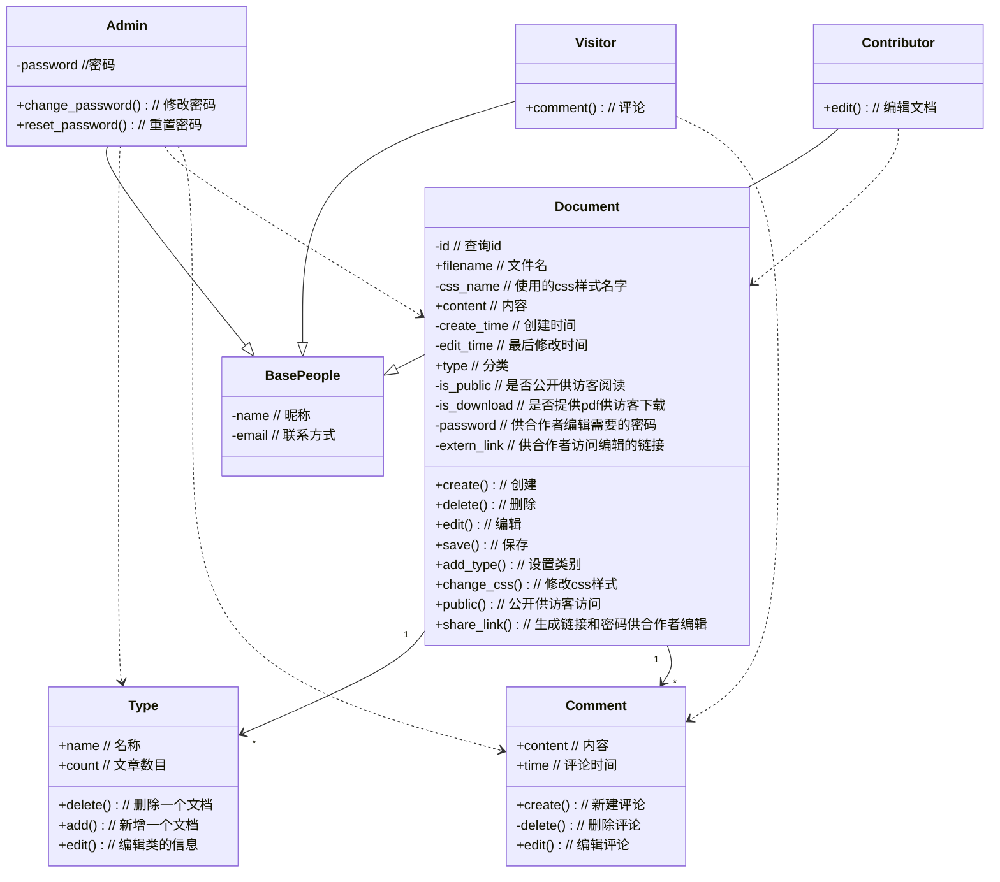

# Mark-It-Down设计：功能分析与建模

> 要求：
>
> （1） 所选项目中拟实现的功能描述。
>
> （2） 针对每个拟实现功能的需求分析，描述清楚操作和执行流程。

## 1. 需求分析

随着远程办公的兴起，在线文档编辑正在不断地成为各大厂商群雄逐鹿的市场，有老牌的Microsoft 365系列，也有逐渐流行的腾讯文档、石墨文档等。他们有的是依靠稳定的环境和兼容性吸引用户、有的则是依靠丰富的模板和团队协作功能吸引客户，但无一例外的是，他们都需要付费。

付费则成了我想开发一款在线文档编辑App的契机，我所需要的功能并不需要那么全，为此付费显然有些不值，那为何不自己开发一款类似的Web App呢。基于这个想法，我给我开发的这款Web App取名叫`Mark It Down`，一来是取自Markdown，代表这款App的主要功能是在线Markdown文档的编辑，二来是展示我开发它的初衷，是为了随时随地能够把自己碎片的想法记录下来，将其标记在这款App中，三来Mark something down的本意是降价，也是暗指这款App是开源且免费的，展示互联网共享的精神。

既然是Web App，那自然不像本地的App那样，重要的是多端的同步和共享机制，也可以做一个附加的展示页面供访客展示，因此在需求分析的时候，既要考虑到我的需求，同时也要考虑到可能的合作者和访客的需求。

### 访客需求

1. 清晰美观的主界面
   - 查看文档站主人的信息
   - 根据分类查看相应的文档合集
   - 简单易用的导航栏
   - 检索文章内容
2. 直观简洁的阅读界面
   - 查看文档目录
   - 自由的调整字体大小
   - 收藏、分享和评论
   - 查看上一篇和下一篇
   - 提供pdf下载（待定）

### 合作者需求

1. 方便的编辑界面
   - 实时预览Markdown文档结果
   - 支持自定义CSS格式（待定）
   - 支持上传图片（提供图床功能）

### 我（管理员）需求

1. 安全需求
   - 需要账号密码进行后台管理
   - 支持修改密码
   - 忘记密码后可以重置（待定）
2. 权限管理
   - 文档是否公开展示
   - 文档是否提供下载
   - 文档是否可以合作编辑
3. 文档管理
   - 支持文档的增删改查
   - 支持分类的增删改查
   - 支持导入导出等功能

## 2.设计

### 类设计

### 界面设计

界面设计的框架选用的是Element Plus，具体需要设计的界面如下：

- 展示界面
  - 供访客查询和阅读文档
  - 供我（管理员）查询和阅读文档
- 编辑界面
  - 供合作者编辑文档
  - 供我（管理员）编辑文档
- 登录界面
  - 登录后台进行管理
- 后台管理界面
  - 供管理员管理文档和分类

### 流程设计

#### 访客流程

#### 合作者流程

#### 管理员流程

## 3.技术选型

- 开发工具：Visual Studio Code
- 后端：
  - 开发语言：Python
  - Web框架：Sanic
    - Sanic框架支持ASGI，且内置Web Server，便于快速部署。
    - Sanic已经逐渐成为最受欢迎的Python异步Web框架之一。
  - 数据库：SQLite
- 前端：
  - 开发语言：Vue3
  - UI框架：Element Plus
