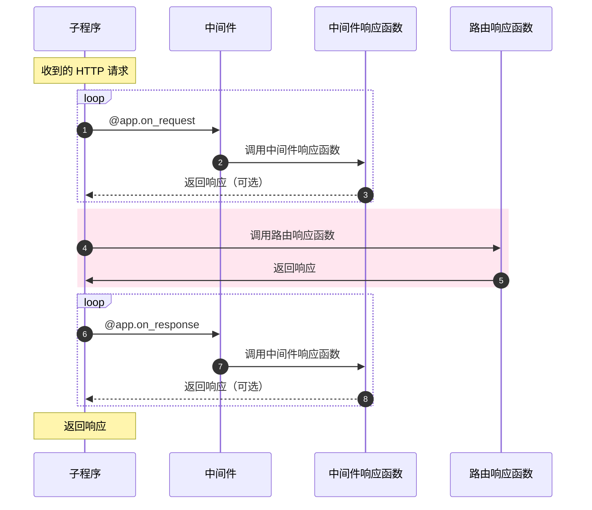

# Mark-It-Down设计：复杂意图设计分析

## 类图、类关系图的优化

在之前的[功能分析与建模](docs/功能分析与建模.md)中，我给出了重要的类图，成员变量和相应的函数。
同样在之前的[核心流程分析](docs/核心流程分析.md)中，我给出了相应的类关系图。

在之后`Coding`的过程中，我也基本按照上述类图实现，除开上述类外，我额外新增了两个工具类，分别是异常处理类以及装饰器类，这两个类基本独立，和其他的类没有太大的关系，就不展开描述了。

## 设计模式的应用

### 代理模式

在 Sanic 框架中，我们通过中间件来实现代理模式，简单来说即在路由响应之前，我们先通过中间件响应函数代理响应，做一些简单的预处理，对于不合规范的请求直接返回响应，减少资源的消耗。



在这次的实现中，我主要关注请求的中间件，例如下面的代码，我们通过`extract_dashboard`来代理所有请求，如果我们接收到的请求中没有相应的参数，我们直接返回错误响应，减少资源的消耗。

```python
@app.on_request
def extract_dashboard(request: Request):

    if request.uri_template == '/dashboard/type':
        type = extract_args(request,'name') 
        if type:
            request.ctx.type = Type(type)
        elif (request.method != 'GET'):
            raise BadRequestBody
    
    if request.uri_template == '/dashboard/article':
        article = extract_args(request,'name')
        type = extract_args(request,'type')
        if article:
            request.ctx.document = Document(article,type)
        elif (request.method != 'GET'):
            raise BadRequestBody
```

### 单例模式（不完全的单例模式）

单例模式中的类，需要满足以下条件：

1. 单例类只能有一个实例。
2. 单例类必须自己创建自己的唯一实例。
3. 单例类必须给所有其他对象提供这一实例。

在我的设计中，我只能保证第一条：单例类只能有一个实例，因此是一个不完全的单例模式。在我们处理一个`Request`请求的时候，往往需要从请求中提取细节并对它们进行预处理。因此我通过上述中间件，在预处理请求的过程中，实例化相应的`Model`类，并将其注入到`Request`上下文中，使得这个类在整个`Request`的生命周期中代理所有对于数据的访问，并在返回`Response`的时候，回写数据库并进行销毁。进而保证了始终只有一个实例的条件

### 装饰器模式

为了更好的创建一个 Web API，在编码时遵循“一次且仅一次”的原则很有必要的，而使用装饰器则是遵循这些原则的最好方式之一，我们可以将特定的逻辑进行封装，灵活的在各种响应函数上复用。

在我的设计中，装饰器模式用于检查重复、鉴权和构建文档，以下面一段代码为例，我们通过`post`方法创建文档的时候，需要通过三个装饰器，第一个装饰器`@openapi.summary()`用于构建文档，方便我查询每个`api`的具体作用；第二个装饰器`@authorized`用于鉴权，因为只有管理员才有权限创建新的文档；第三个装饰器`@check_exist()`用于检查重复，因为我们不允许创建重复的文档。

```python
class dashboard_document(HTTPMethodView):

    @openapi.summary("This is used to create a document")
    @authorized
    @check_exist('document',is_exist=True)
    def post(self, request: Request):
        request.ctx.document.create_document()
        request.ctx.document.update_text("# Hello World")
        return json({'message':'create successful'})
```

## 总结

稍微有些遗憾的是，我这次选择的是Web App的开发，并且选择了前后端分离的策略，我需要同时写前端和后端的代码。由于时间有限，再加上很多东西是边学边写，并未能够实现所有想要的功能，但是最基本的功能都已经实现，框架基本构建完成，网页也能够正常的运行。希望在以后的日子里，能够继续对这个App进行完善，甚至是重构，达到我真正想要的效果。

在之后的报告中，我将会做一个总结，并对一些其他的设计原则做一些相应的描述。