# Mark-It-Down 设计实现 期末报告

## 简介

随着远程办公的兴起，在线文档编辑正在不断地成为各大厂商群雄逐鹿的市场，有老牌的Microsoft 365系列，也有逐渐流行的腾讯文档、石墨文档等。他们有的是依靠稳定的环境和兼容性吸引用户、有的则是依靠丰富的模板和团队协作功能吸引客户，但无一例外的是，他们都需要付费。

付费则成了我想开发一款在线文档编辑App的契机，我所需要的功能并不需要那么全，为此付费显然有些不值，那为何不自己开发一款类似的Web App呢。基于这个想法，我给我开发的这款Web App取名叫`Mark It Down`，一来是取自Markdown，代表这款App的主要功能是在线Markdown文档的编辑；二来是展示我开发它的初衷，是为了随时随地能够把自己碎片的想法记录下来，将其标记在这款App中。

## 功能分析与建模

### 需求分析

在需求分析的时候，考虑到我设计的App是一款Web App，那自然不像本地的App那样将只关注本地的存储，更重要的是多端的同步和共享机制。

此外也可以设计一个附加的展示页面供访客阅读，并适当的将编辑页面开放给可能的合作者。因此在需求分析的时候，既要考虑到我的需求，同时也要考虑到可能的合作者和访客的需求。

#### 访客需求

1. 清晰美观的主界面
   - 查看文档站主人的信息
   - 根据分类查看相应的文档合集
   - 简单易用的导航栏
   - 检索文章内容
2. 直观简洁的阅读界面
   - 查看文档目录
   - 自由的调整字体大小
   - 收藏、分享和评论
   - 查看上一篇和下一篇
   - 提供pdf下载

#### 合作者需求

1. 方便的编辑界面
   - 实时预览Markdown文档结果
   - 支持自定义CSS格式
   - 支持上传图片（提供图床功能）

#### 我（管理员）需求

1. 安全需求
   - 需要账号密码进行后台管理
   - 支持修改密码
   - 忘记密码后可以重置
2. 权限管理
   - 文档是否公开展示
   - 文档是否提供下载
   - 文档是否可以合作编辑
3. 文档管理
   - 支持文档的增删改查
   - 支持分类的增删改查
   - 支持导入导出等功能

### 界面设计

通过上面的需求分析，我一共设计了四个界面，分别是登录界面、主页、阅读/编辑界面、后台界面。不同界面分别实现上述不同的功能，在下面具体介绍。

#### 登录界面

在登录界面中，我主要实现的是管理员需求中的“安全需求”，在登录后根据不同的用户类型提供不同的权限，进而实现安全管理的需求，具体的页面设计如下：

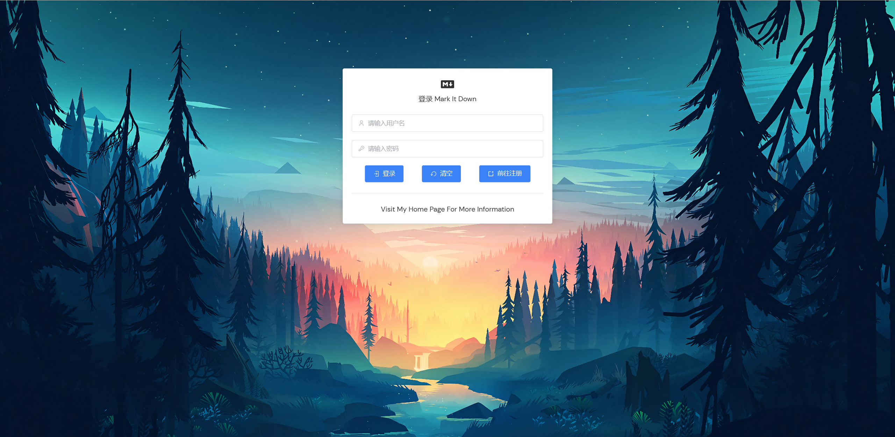

#### 主页

在主界面中，我主要实现的是访客需求中的“清晰美观的主界面”，在登录后自动跳转到主页，展示当前文档站的主要信息，具体的页面设计如下：

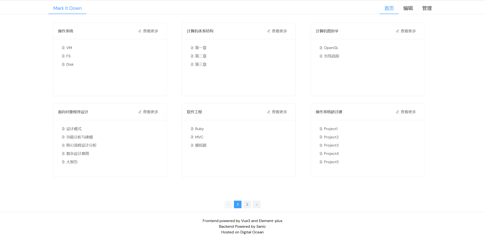

#### 阅读/编辑界面

在阅读/编辑界面中，我实现了访客需求中的“直观简洁的阅读界面”和合作者需求中的“方便的编辑界面”，根据不同的用户角色，决定是否开放编辑功能，具体的页面设计如下：

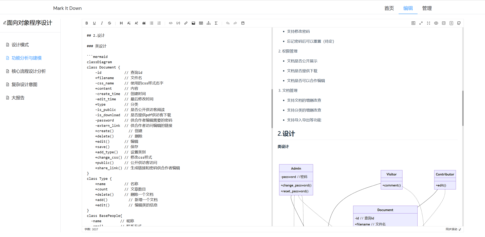

#### 后台界面

在后台界面中，我实现了管理员需求中的“权限管理”和“文档管理”，这个界面只有管理员有权限进入，可以方便的对文章、分类和用户进行管理，具体的页面设计如下：

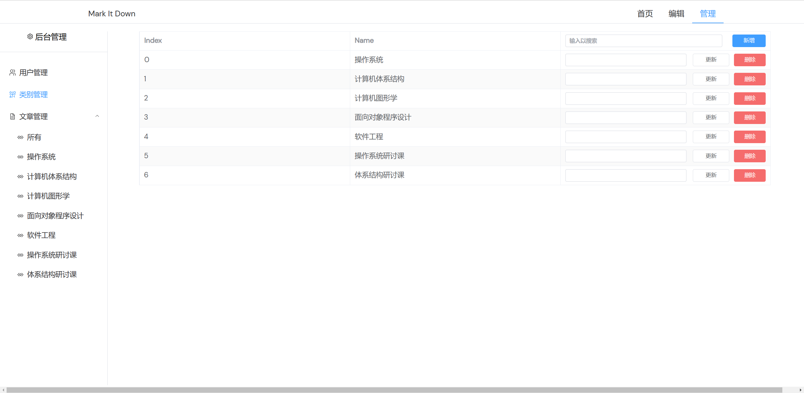

### 交互流程设计

利用上述四个界面，可以针对不同的用户设计简单的流程图，如下：

#### 访客/合作者流程

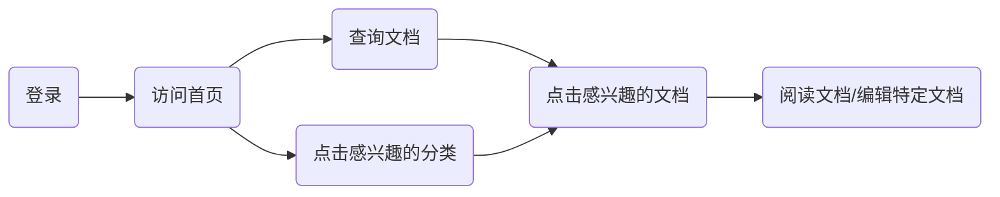

#### 管理员流程

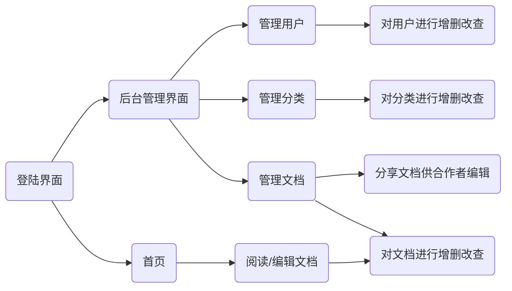

### 类设计

在设计好了需求、主界面和流程后，接下来就是设计主要的模型类：

1. User类：用户类，保存用户的基本信息，在其基础上衍生出下面三个子类，对应三种用户角色
    - Admin：管理员类，拥有所有的权限
    - Visitor：访客类，只有浏览的权限
    - Contributor：合作者类，对部分文章有编辑权限

2. Document类：文档类，保存文档的基本信息，在其基础上聚合两个属性类，方便管理文档的其他信息
    - Type类：文档的类别，和文档是一对多的关系
    - Comment类：评论类，和文档是一对多的关系

#### 类图

设计完成的类图展示如下：

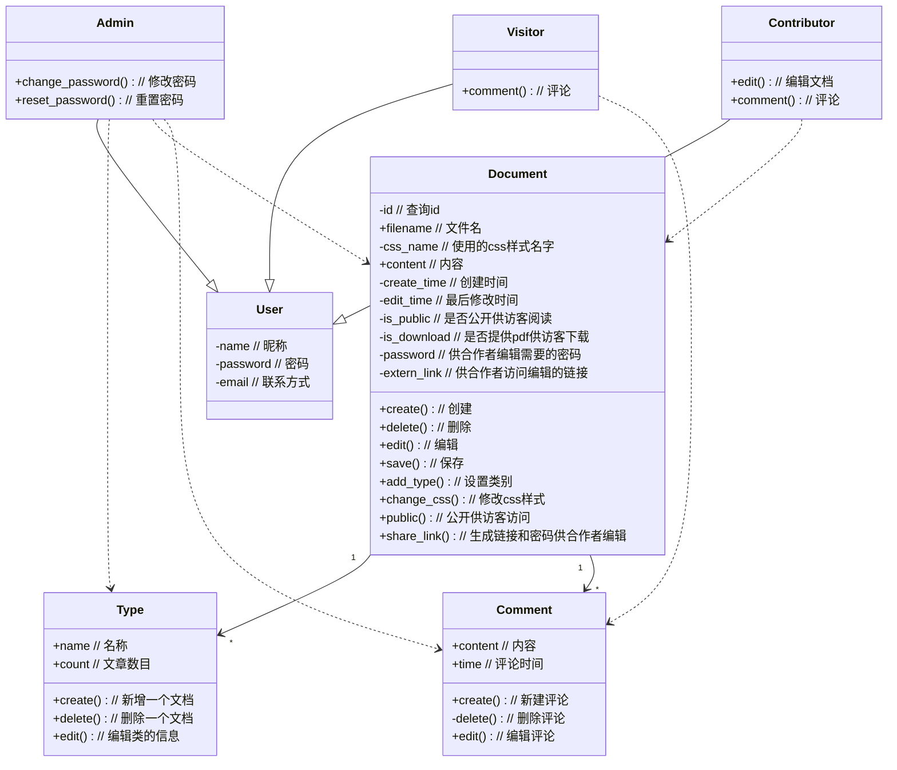

## 核心流程分析

### 类关系图

在完整的类设计中，我采取了`MVC`的设计模式，即将`Model`、`View`和`Controller`分离：

1. `Model`为`Document`和`User`两个大类，两者分别继承或聚合了一些子类，便于管理，具体的类设计图也如上图所示，这里不再赘述。
2. `View`部分我采取了前后端分离的策略，在前端中采用`Vue`框架进行实现。
3. `Controller`部分则有`ControllerLogin`、`ControllerEdit`、`ControllerHomepage`和`ControllerDashboard`四个类，分别对应着四个页面的控制器，它们都是`HTTPMethodView`的子类，便于实现`RESTful`风格的接口。

具体的类关系图展示如下：

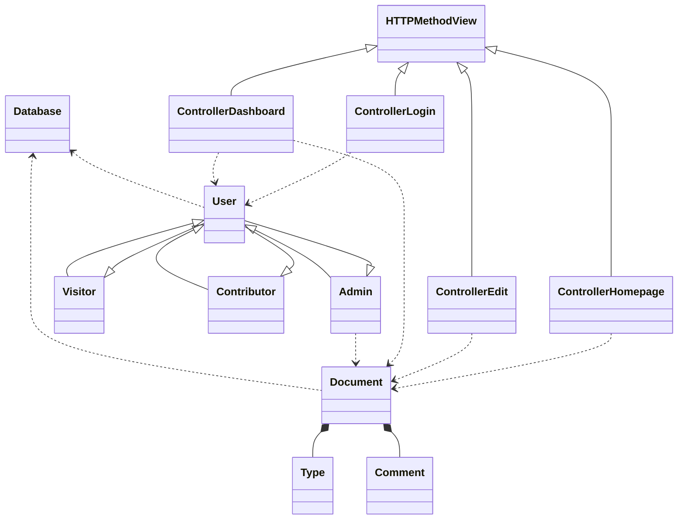

### 流程设计

在流程设计部分，不同于上文中粗略的流程设计，这次的流程设计中，我选择采用时序图的形式，更加鲜明的展示前端、后端以及数据库交互的流程。

#### 登录/注册流程

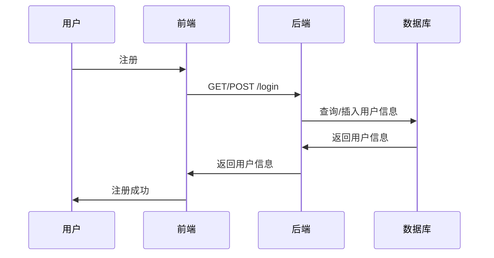

#### 主页展示流程

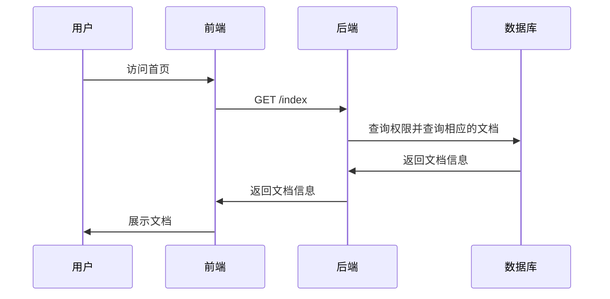

#### 阅读/编辑文档流程

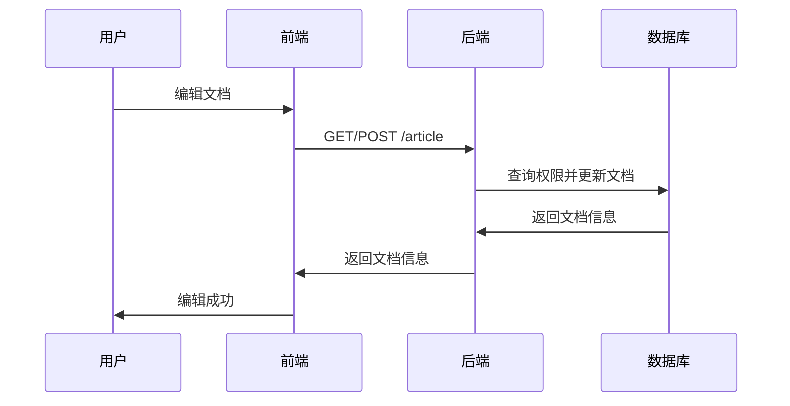

#### 管理员管理流程（以新增用户为例）

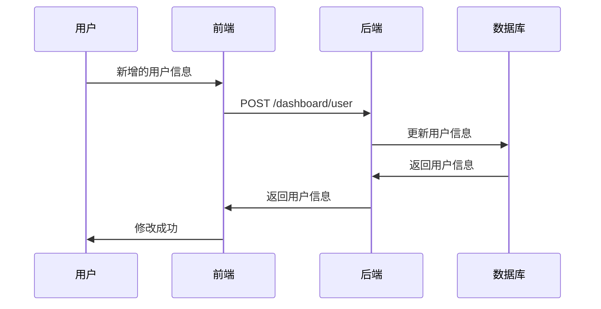

## 复杂设计意图分析

尽管在这次设计实现中，我想要实现的设计功能并不复杂，代码量也不是很大，但作为一个大作业也是一个实验性的项目，我有意识的多使用一些设计模式和新的技术，来体会他们的意图和优势。下面我将分为两个部分来叙述文档复杂设计意图，分别是技术选型、设计模式的运用以及其他技术的使用。

### 技术选型

在这次的技术选型中，我希望都能够使用当今最新的技术，来体会他们的优势和对开发带来的便利。

在前端的设计中，我选择了使用[Vitesse](https://github.com/antfu/vitesse)作为脚手架，我选择的是其轻量化的版本，包括了Vue3 + Vite + Typescript的组合，UI框架我选择的是Element-Plus，这基本是现在最流行的前端技术栈了。当然由于前端不是我这次实现的重点，再加上我对于前端也不够熟悉，我希望能够有办法让我专注于代码上。因此我非常感谢这个脚手架和工具链，它为我的开发提供了巨大的便利，也显著的降低了我的学习成本，让我能够更加的专注于后端的设计。

在后端的设计上，我选择了[Sanic](https://sanic.dev/zh)框架。我之所以没选择python中流行的Django和Flask框架，而是选择了Sanic。一方面是因为Sanic是特别为异步优化的框架，在性能上有很大的提升；另一方面是因为Sanic的文档较为简洁易懂。在这次的开发中，我基本使用或尝试了Sanic所有的新鲜功能，包括基于类的视图、流式传输、异常处理、中间件、装饰器、蓝图和日志等；当然还有一些有趣的功能，如后台任务、ORM和注入等，也是可以加入到我的程序之中，感谢Sanic框架，让我在后端的开发中能够更加专注和高效。

### 设计模式的运用

#### 代理模式

在 Sanic 框架中，往往通过中间件来实现代理模式，简单来说即在路由响应之前，先通过中间件响应函数代理响应，做一些简单的预处理，对于不合规范的请求直接返回响应，减少资源的消耗，下面是一个简单的时序图，来讲解中间件具体的生效位置。

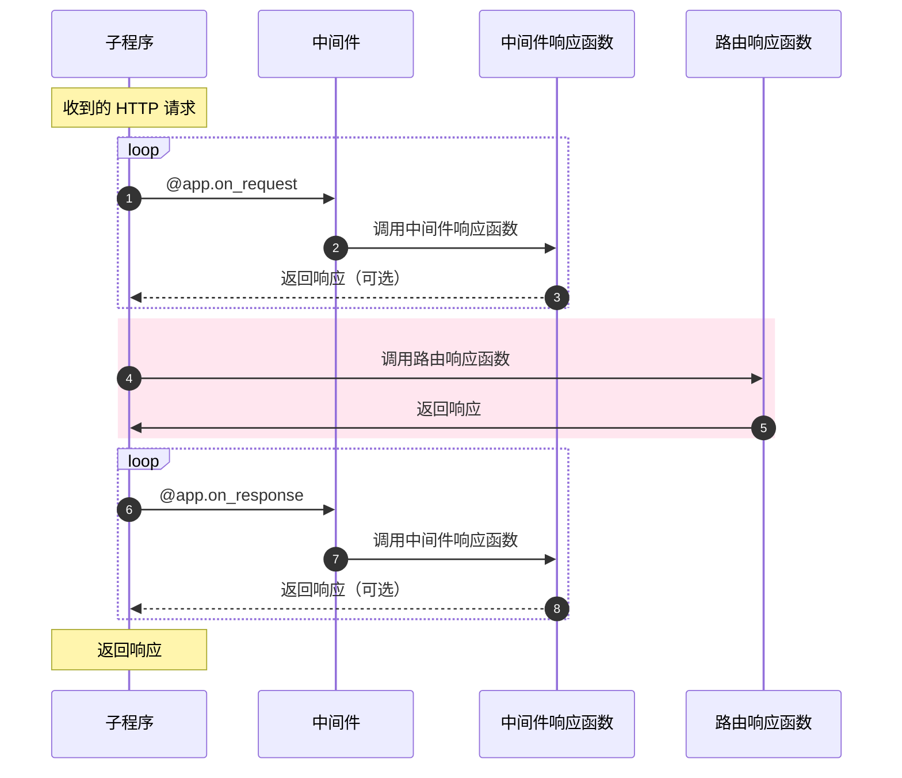

在这次的实现中，我主要关注请求的中间件，例如下面的代码，我通过`extract_dashboard`来代理所有请求，如果接收到的请求中没有相应的参数，则直接返回错误响应，减少资源的消耗。

```python
@app.on_request
def extract_dashboard(request: Request):
    if request.uri_template == '/dashboard/type':
        type = extract_args(request,'name') 
        if type:
            request.ctx.type = Type(type)
        elif (request.method != 'GET'):
            raise BadRequestBody   
    if request.uri_template == '/dashboard/article':
        article = extract_args(request,'name')
        type = extract_args(request,'type')
        if article:
            request.ctx.document = Document(article,type)
        elif (request.method != 'GET'):
            raise BadRequestBody
```

此外，我还有`extract_user`来代理用户相关的请求，例如登录、注册等，还有`extract_article`来代理文章相关的请求，例如文章的编辑和查看等，核心的逻辑基本一致。

在`extract_user`中，我也特别使用了`cookie`来保存已登录的用户信息，避免重复的登录。

```python
def extract_user(request: Request):
    if request.uri_template == '/login':
        username = extract_args(request,'username')
        password = extract_args(request,'password')      
        if not username or not password:
            raise BadRequestBody      
        request.ctx.user = User(username,password)
    else:
        id = request.cookies.get('id')
        if not id:
            raise Unauthorized
        else:
            request.ctx.user = get_user(int(id))

def extract_document(request: Request):
    if request.uri_template =='/article':
        type = extract_args(request,'type')
        article = extract_args(request,'article')
        if (not article and request.method != 'GET'):
            raise BadRequestBody      
        request.ctx.document = Document(article,type)
```

#### 单例模式（不完全的单例模式）

单例模式中的类，需要满足以下条件：

1. 单例类只能有一个实例。
2. 单例类必须自己创建自己的唯一实例。
3. 单例类必须给所有其他对象提供这一实例。

在我的设计中，我只能保证第一条：单例类只能有一个实例，因此是一个不完全的单例模式。在后端处理一个`Request`请求的时候，往往需要从请求中提取细节并对它们进行预处理。因此我通过上述中间件，在预处理请求的过程中，实例化相应的`Model`类，并将其注入到`Request`上下文中，使得这个类在整个`Request`的生命周期中代理所有对于数据的访问，并在返回`Response`并回写数据库并进行销毁。进而保证了始终只有一个实例的条件

#### 装饰器模式

在我的设计中，为了更好的复用代码，在编码时遵循“DRY”的原则很有必要的，而使用装饰器则是遵循这些原则的最好方式之一，因此我选择将特定的逻辑进行封装，灵活的在各种响应函数上复用。

在这次的设计实现中，装饰器模式用于检查重复、鉴权和构建文档，以下面一段代码为例，当通过`post`方法创建文档的时候，需要通过三个装饰器，第一个装饰器`@openapi.summary()`用于构建文档，方便我查询每个`api`的具体作用；第二个装饰器`@authorized`用于鉴权，因为只有管理员才有权限创建新的文档；第三个装饰器`@check_exist()`用于检查重复，因为创建重复的文档是不被允许的。

```python
class check_exist(object):
    def __init__(self,item_name,is_exist=False):
        self.item_name = item_name
        self.is_exist = is_exist
    def __call__(self,func):
        @wraps(func)
        def decorated_function(*args, **kwargs):
            result = getattr(args[1].ctx,self.item_name).exist()
            if not result and not self.is_exist:
                raise NotFound
            if result and self.is_exist:
                raise AlreadyExists
            return func(*args, **kwargs)
        return decorated_function

def authorized(func):
    @wraps(func)
    def decorated_func(*args,**kwargs):
        if args[1].ctx.user.__class__.__name__ != 'Admin':
            raise Unauthorized
        return func(*args,**kwargs)
    return decorated_func

class controller_dashboard(HTTPMethodView):
    @openapi.summary("This is used to create a document")
    @authorized
    @check_exist('document',is_exist=True)
    def post(self, request: Request):
        request.ctx.document.create_document()
        request.ctx.document.update_text("# Hello World")
        return json({'message':'create successful'})
```

### 其他技术的应用

#### 异步

异步是我在这次的设计中使用的一个重要技术，它可以让程序在等待某些操作完成的时候，不会阻塞，而是可以继续执行其他的操作，从而提高程序的效率。在这次的设计中，前端框架我使用了`axios`来实现异步的发送`Http`请求，这样就能够让前端页面能够在等待后端响应的时候，不会阻塞，而是可以继续执行其他的操作，从而提高用户的体验。

```ts
function login() {
  axios.get('/api/login', {
    params: {
      username: loginForm.value.username,
      password: loginForm.value.password,
    },
  }).then(() => {
    ElMessage.success('登录成功')
    router.push('/home')
  }).catch(() => {
    ElMessage.error('请输入正确的用户名和密码')
    reset()
  })
}
```

在后端的实现中，我同样使用了异步的框架`sanic`。但是由于时间有限，我对数据库的访问简单的使用了`python`自带的`sqlite3`模块，而非选择了异步框架`SQLAlchemy`，使得我在后端对于异步的支持没能够达到完美。

#### 前后端分离

前后端分离是我在这次的设计中使用的另一个重要技术，在前端的实现中，只需关注内容的展示；在后端的实现中，只需关注数据处理和持久化，达到了前后端解耦的目的，这样使得两者的开发能够独立进行，也更加有利于我的调试和开发。

## 总结

在整个面向对象编程的学习过程中，我学到了非常多的知识，也成功的学以致用，完成了这次Web App的开发。稍微有些遗憾的是，由于时间有限，再加上很多东西是边学边写，并未能够实现所有想要的功能。

但是“麻雀虽小、五脏俱全”，尽管设计的业务逻辑不复杂，实现的功能也不够完美，但是我用到的面向对象技术、设计模式以及一些新技术的运用却都是实打实的，也是能够让我在以后的开发中有所借鉴的。我想这才是这次我选择设计实现最大的收获。