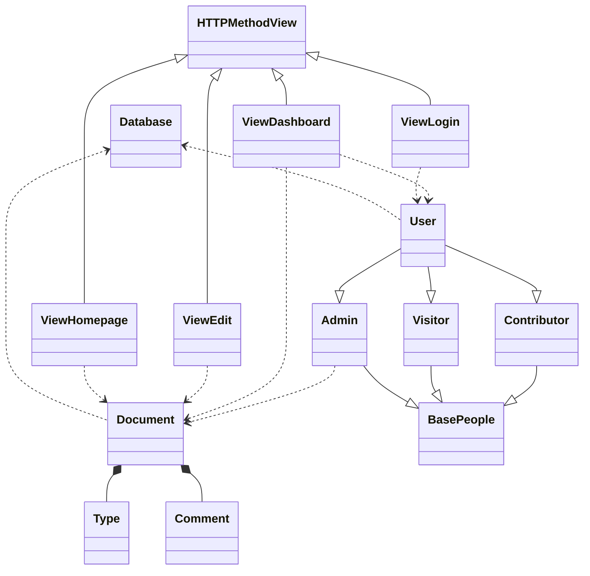
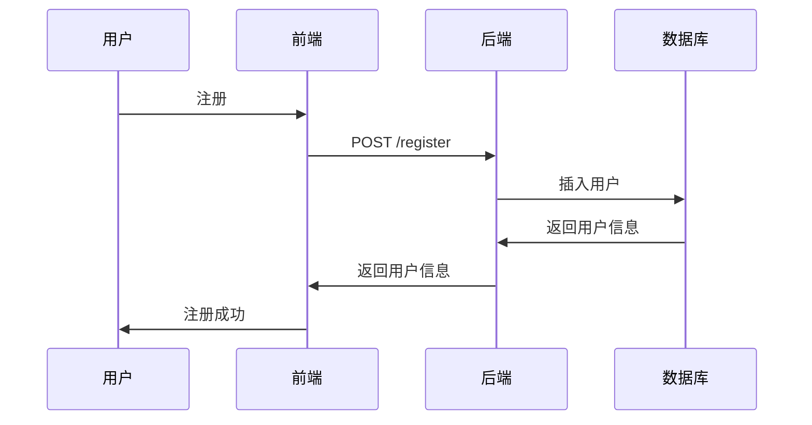
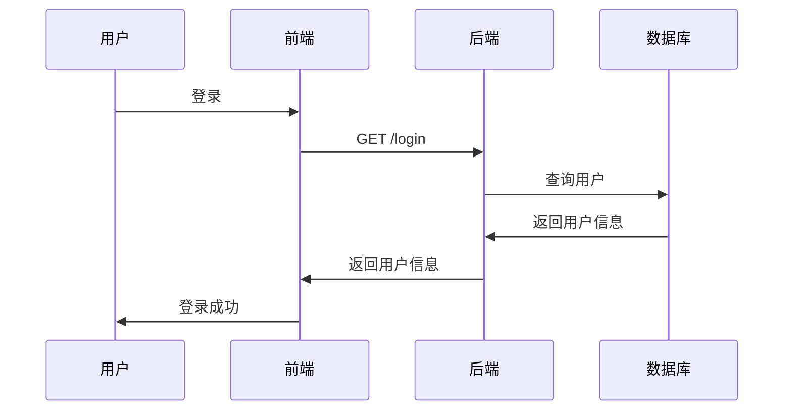
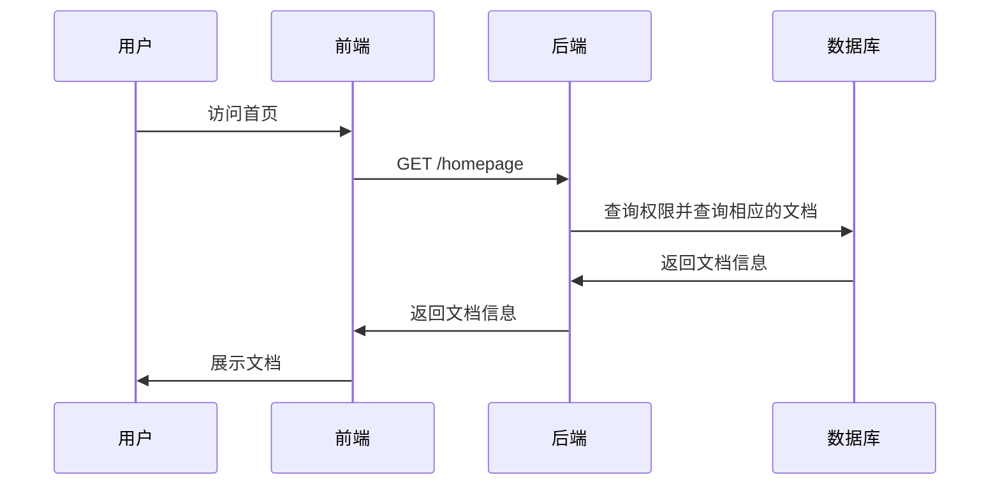
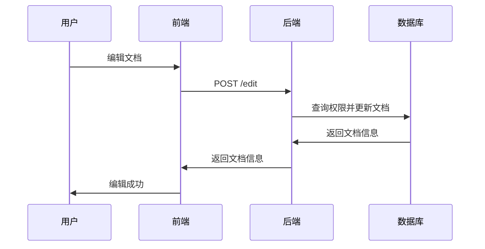
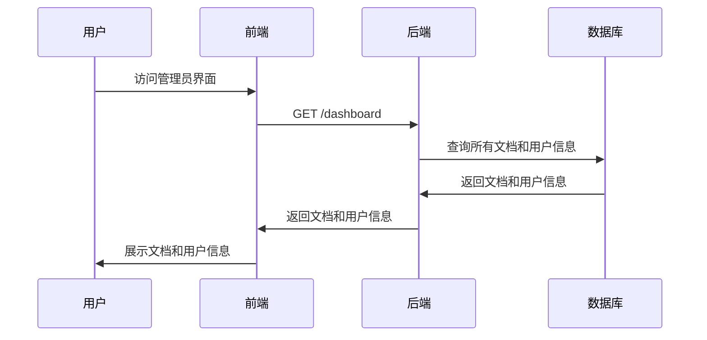
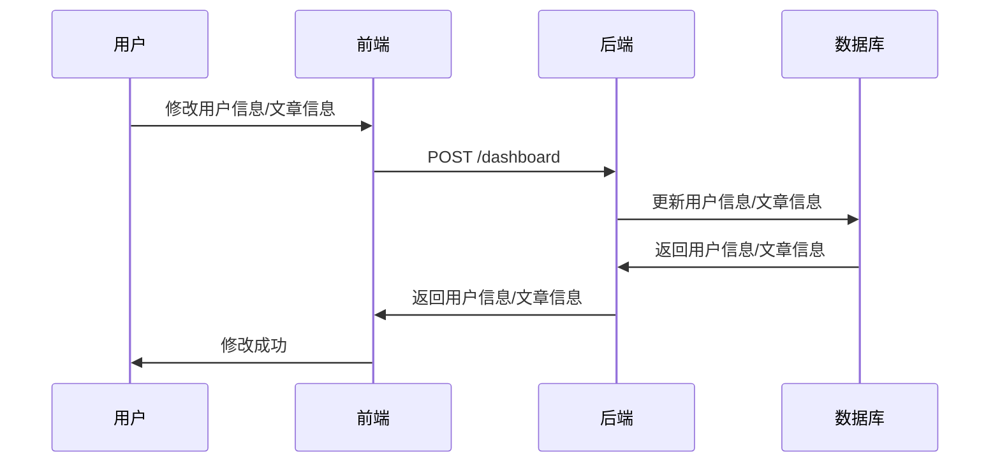

# Mark-It-Down设计：核心流程设计分析

## 类关系图

绝大多数的类图已在[功能分析与建模](docs/功能分析与建模.md)中列出，这里不再赘述，直接给出类关系图：

这次的类设计中，我遵循了`MVC`的设计原则。

- `Model`为`Document`和`User`两个大类，两者分别继承或聚合了一些子类，便于分别管理。
- `View`部分我采取了前后端分离的策略，在前端中采用`Vue`框架进行实现。
- `Controller`部分则有`ViewLogin`、`ViewHomepage`、`ViewEdit`、`ViewDashboard`四个类，分别对应着四个页面的控制器，它们都是`HTTPMethodView`的子类，便于实现`RESTful`风格的接口。

## 核心流程设计

在[功能分析与建模](docs/功能分析与建模.md)中我已经列举出了大致的流程图，在这里绘制详细的时序图。

### 注册流程

### 登录流程

### 首页展示
    

### 编辑/新建文档

### 管理员界面

### 管理员修改

