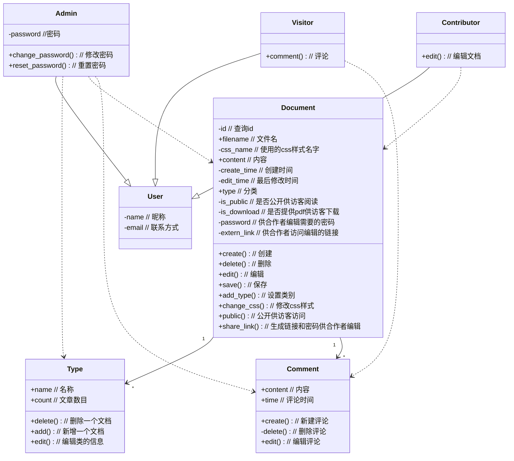
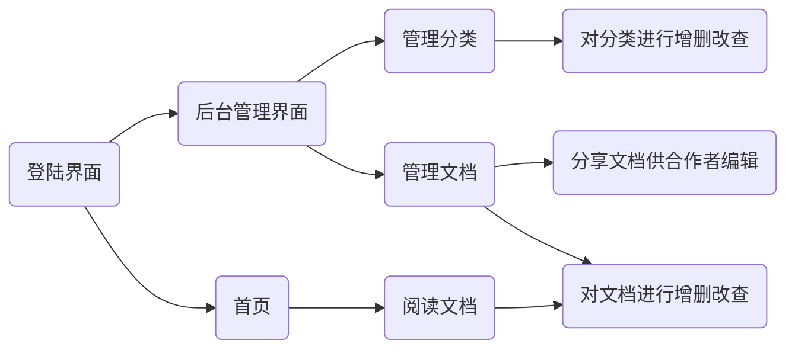
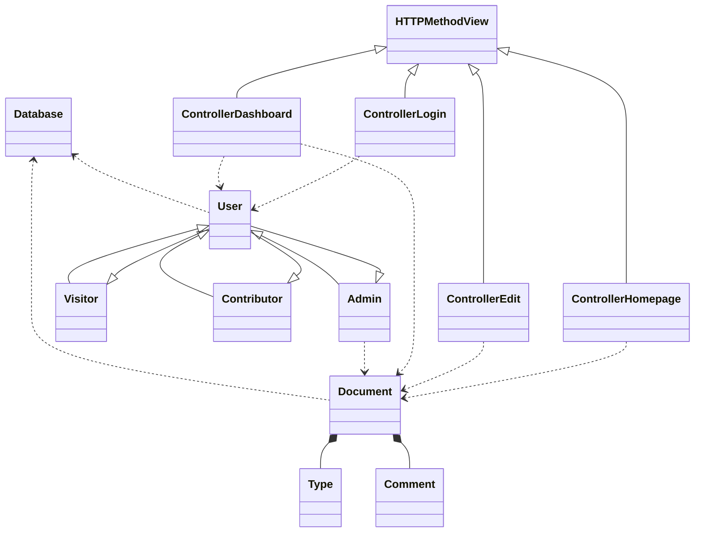
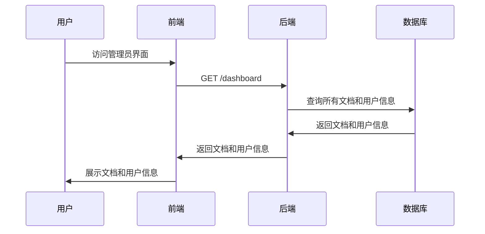
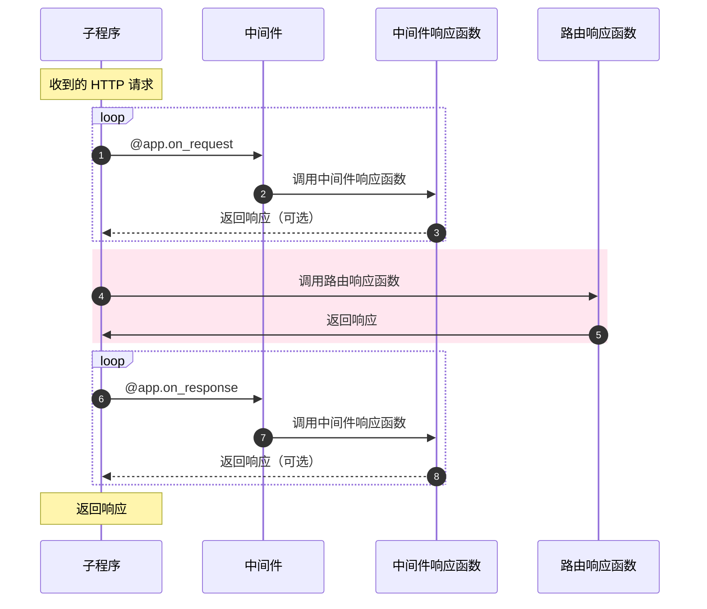
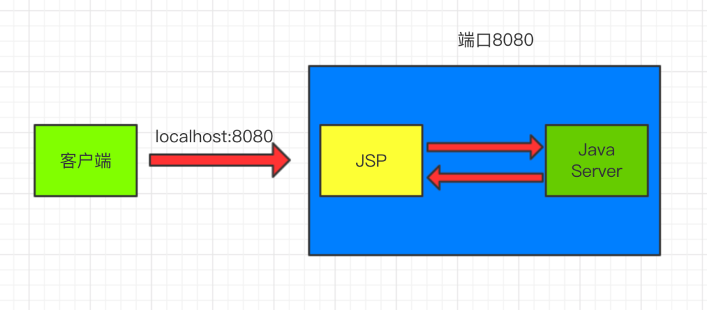
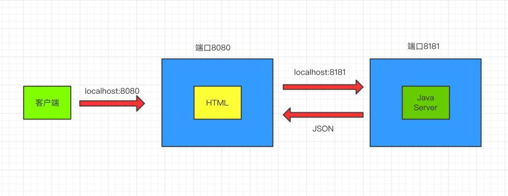

# Mark-It-Down 
## 设计实现课堂研讨报告


<h3 align="right" style="margin-top: 10px"> 余俊达 2020K8009926001 </h3>

---

# 目录

<div class="menu" style="font-size: 24px">

1. 简介
2. 功能分析与建模
3. 核心流程设计分析
4. 复杂设计意图分析
5. 总结

</div>

---

# 简介
-- Introduction

随着远程办公的兴起，在线文档编辑正在不断地成为各大厂商群雄逐鹿的市场，有老牌的Microsoft 365系列，也有逐渐流行的腾讯文档、石墨文档等。他们有的是依靠稳定的环境和兼容性吸引用户、有的则是依靠丰富的模板和团队协作功能吸引客户，但无一例外的是，他们都需要付费。

付费则成了我想开发一款在线文档编辑App的契机，我所需要的功能并不需要那么全，为此付费显然有些不值，那为何不自己开发一款类似的Web App呢。基于这个想法，我给我开发的这款Web App取名叫`Mark It Down`，一来是取自Markdown，代表这款App的主要功能是在线Markdown文档的编辑；二来是展示我开发它的初衷，是为了随时随地能够把自己碎片的想法记录下来，将其标记在这款App中。

既然是Web App，那自然不像本地的App那样，重要的是多端的同步和共享机制，也可以做一个附加的展示页面供访客展示，因此在需求分析的时候，既要考虑到我的需求，同时也要考虑到可能的合作者和访客的需求。

---

# 功能分析与建模
-- 需求分析

<div grid="~ cols-2 gap-2" m="-t-2">

<div>

<b> 登录界面 </b>

1. 安全需求
   - 需要账号密码进行后台管理
   - 支持修改密码
   - 忘记密码后可以重置

<b> 主页 </b>

1. 清晰美观的主界面
   - 查看文档站主人的信息
   - 根据分类查看相应的文档合集
   - 简单易用的导航栏

</div>
<div>

<b> 阅读/编辑界面 </b>

1. 直观简洁的阅读/编辑界面
   - 查看文档目录
   - 实时预览Markdown文档结果
   - 支持上传图片

<b> 后台界面 </b>

1. 文档管理
   - 支持文档的增删改查
   - 支持分类的增删改查
   - 支持导入导出等功能

</div>
</div>

---

# 功能分析与建模
-- 登录界面

<div class="image" style="width: 95%; display:flex; margin:0 auto;">


</div>

---

# 功能分析与建模
-- 主界面

<div class="image" style="width: 95%; display:flex; margin:0 auto;">


</div>

---

# 功能分析与建模
-- 编辑界面

<div class="image" style="width: 95%; display:flex; margin:0 auto;">


</div>

---

# 功能分析与建模
-- 管理界面

<div class="image" style="width: 95%; display:flex; margin:0 auto;">


</div>

---

# 功能分析与建模
-- 基本类图

<div grid="~ cols-2 gap-2" m="-t-2">



<div>

<b> 抽象出的基本模型类 </b>

- User类：用户类，保存用户的基本信息。
    1. Admin：管理员类，拥有所有的权限
    2. Visitor：访客类，只有浏览的权限
    3. Contributor：合作者类，对部分文章有编辑权限

- Document类：文档类，保存文档的基本信息。
    1. Type类：文档的类别，和文档是一对多的关系
    2. Comment类：评论类，和文档是一对多的关系

</div>
</div>

---

# 功能分析与建模
-- 基本流程图

<b> 以管理员为例 </b>



---

# 核心流程设计分析
-- 类关系图

<div grid="~ cols-2 gap-2" m="-t-2">



<div>

完整的类设计中，我遵循了`MVC`的设计原则。

- `Model`为`Document`和`User`两个大类，两者分别继承或聚合了一些子类，便于分别管理。
- `View`部分我采取了前后端分离的策略，在前端中采用`Vue`框架进行实现。
- `Controller`部分则有`ViewLogin`、`ViewEdit`、`ViewHomepage`、`ViewDashboard`四个类，分别对应着四个页面的控制器，它们都是`HTTPMethodView`的子类，便于实现`RESTful`风格的接口。

</div>
</div>

---

# 核心流程设计分析
-- 流程设计



---

# 复杂意图设计分析
-- 设计模式的运用

<div grid="~ cols-2 gap-2" m="-t-2">

<div>



</div>

<div class="code">

<b> 代理模式 </b>

```python
@app.on_request
def extract_dashboard(request: Request):

    if request.uri_template == '/dashboard/type':
        type = extract_args(request,'name') 
        if type:
            request.ctx.type = Type(type)
        elif (request.method != 'GET'):
            raise BadRequestBody
    
    if request.uri_template == '/dashboard/article':
        article = extract_args(request,'name')
        type = extract_args(request,'type')
        if article:
            request.ctx.document = Document(article,type)
        elif (request.method != 'GET'):
            raise BadRequestBody
```

</div>
</div>

---

# 复杂意图设计分析
-- 设计模式的运用

<div grid="~ cols-2 gap-2" m="-t-2">

<div>

<b> 装饰器模式 </b>

为了更好的创建一个 Web API，在编码时遵循“一次且仅一次”的原则很有必要的，而使用装饰器则是遵循这些原则的最好方式之一，我们可以将特定的逻辑进行封装，灵活的在各种响应函数上复用。

```python
class view_dashboard(HTTPMethodView):

    @openapi.summary("This is used to create a document")
    @authorized
    @check_exist('document',is_exist=True)
    def post(self, request: Request):
        request.ctx.document.create_document()
        request.ctx.document.update_text("# Hello World")
        return json({'message':'create successful'})
```

</div>

<div style="position: absolute; top: 10%; right:5%;">

```python
class check_exist(object):

    def __init__(self,item_name,is_exist=False):
        self.item_name = item_name
        self.is_exist = is_exist

    def __call__(self,func):
        @wraps(func)
        def decorated_function(*args, **kwargs):
            result = getattr(args[1].ctx,self.item_name).exist()
            if not result and not self.is_exist:
                raise NotFound
            if result and self.is_exist:
                raise AlreadyExists
            return func(*args, **kwargs)
        return decorated_function

def authorized(func):
    @wraps(func)
    def decorated_func(*args,**kwargs):
        if args[1].ctx.user.__class__.__name__ != 'Admin':
            raise Unauthorized
        return func(*args,**kwargs)
    return decorated_func
```
</div>
</div>

---

# 复杂意图设计分析
-- 其他设计意图

<div grid="~ cols-2 gap-2" m="-t-2">
<div>

<b> 异步 </b>

异步：不等任务执行完，直接执行下一个任务。

```ts
function login() {
  axios.get('/api/login', {
    params: {
      username: loginForm.value.username,
      password: loginForm.value.password,
    },
  }).then(() => {
    ElMessage.success('登录成功')
    router.push('/home')
  }).catch(() => {
    ElMessage.error('请输入正确的用户名和密码')
    reset()
  })
}
```
</div>
<div>

<b> 前后端分离 </b>

前后端分离：前端只负责展示，后端只负责数据处理，达到前后端的解耦，便于调试与开发。

<div style="width: 60%">


</div>



</div>
</div>

---

# 总结
-- Summary

在整个面向对象编程的学习过程中，我学到了非常多的知识，也成功的学以致用，完成了这次Web App的开发

稍微有些遗憾的是，由于时间有限，再加上很多东西是边学边写，并未能够实现所有想要的功能。

但是框架已经构建完成，最基本的功能都已经实现，网页也能够正常的运行。

希望在以后的日子里，能够继续对这个App进行完善，甚至是重构，达到我真正想要的效果。
